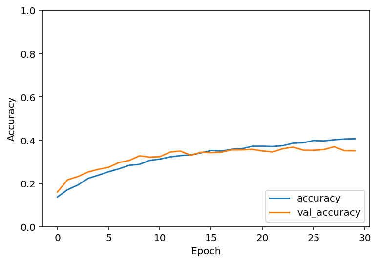
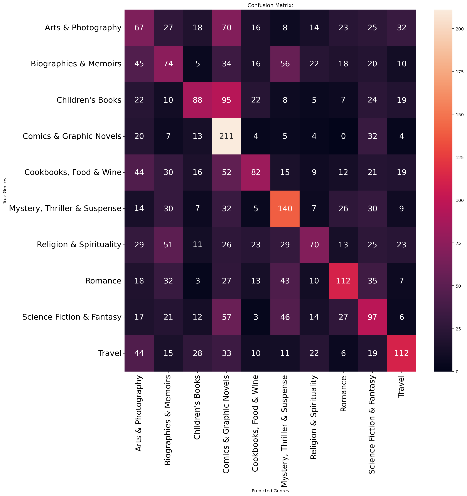
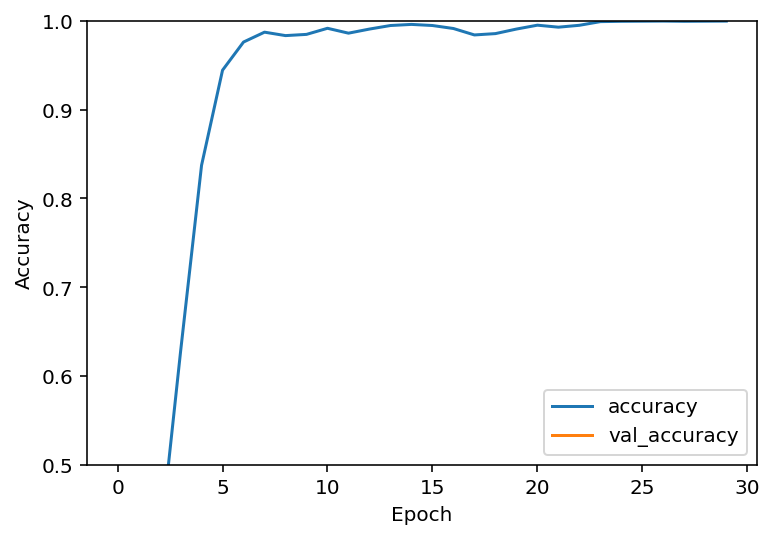
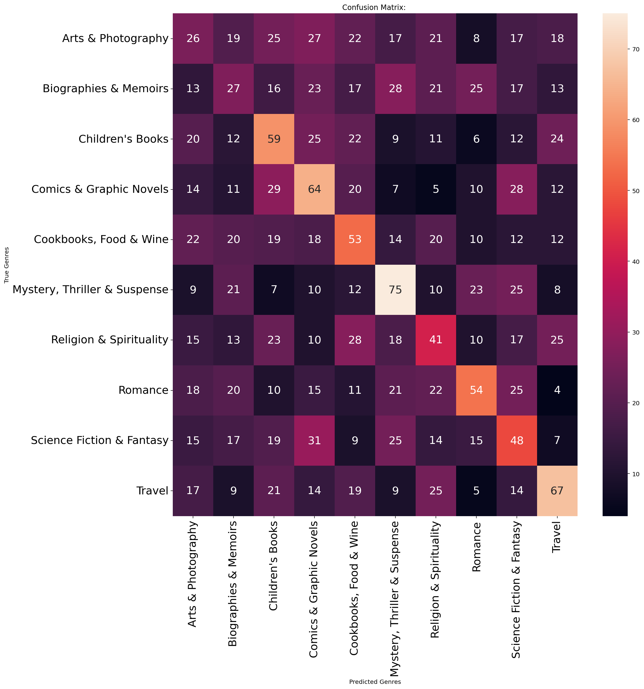
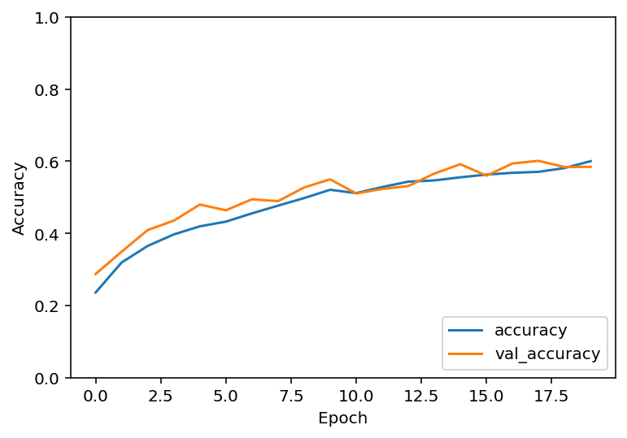
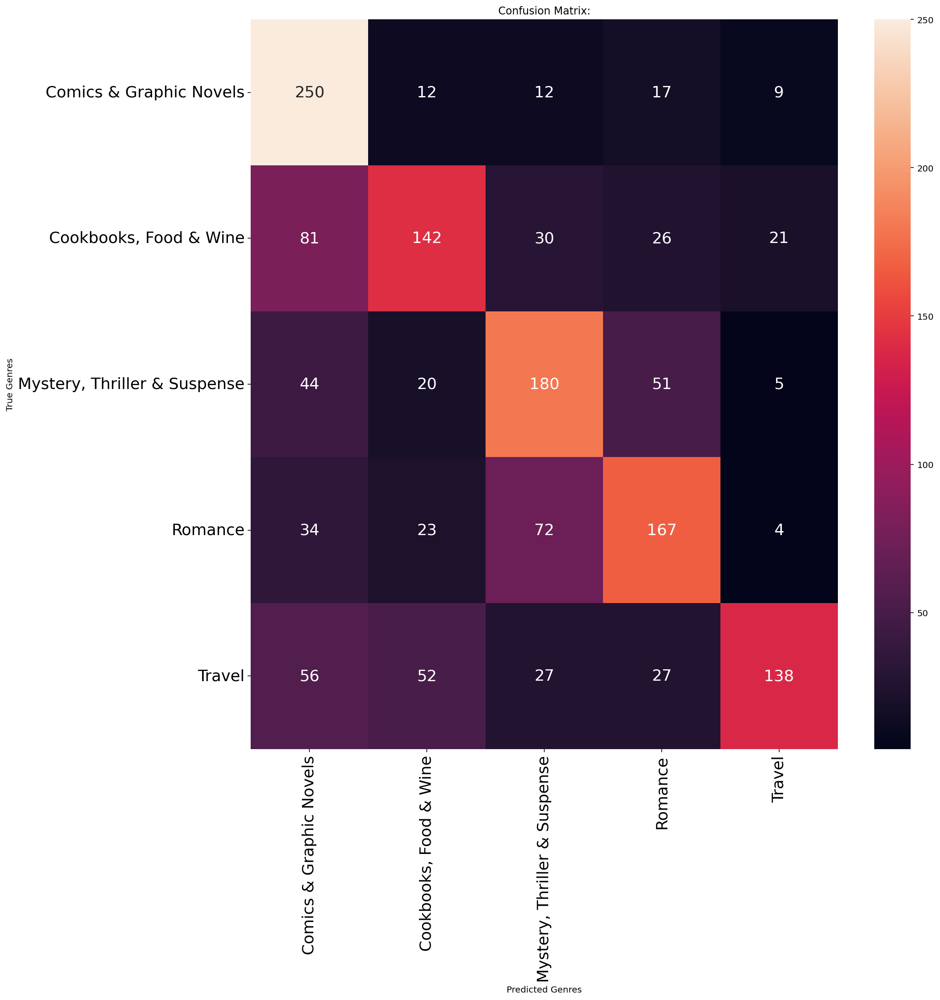

# Book Cover Image Classification Using CNNs

A convolutional neural network that predicts a book's literary genre from its cover image alone — built for CS 435 (Applied Deep Learning) at Oregon State University.

## The idea

Readers can often guess a book's genre just from its cover — color palette, typography, and artwork style all signal genre before anyone reads a synopsis. This project asks whether a CNN can learn the same visual cues, using only the raw cover image as input (no title, no metadata, no text).

## Dataset

[Book Cover Dataset](https://github.com/uchidalab/book-dataset) (Uchida Lab) — Amazon book metadata paired with cover image URLs across 30 genre categories, ~207,000 books total.

For this project, 10 genres were selected and a balanced sample of images per category was downloaded, resized, and normalized for training. The raw dataset isn't included in this repo (see [Notes on reproducing](#notes-on-reproducing) below) — `download_images.py` will fetch it from the source listing.

## Approach

Built and iterated on a CNN in TensorFlow/Keras: convolution + ReLU + max-pooling blocks, flattened into dense layers, with a softmax output over the genre classes.

**v1 — baseline (2 conv layers, 30 epochs):** ~100% training accuracy, only ~25.7% testing accuracy — classic overfitting. The model was memorizing training images rather than learning generalizable features.

**v2 — shrink + regularize:** Reduced the dense layer size, added dropout, cut epochs to 15. Barely moved the needle (~25.9%) — the real bottleneck wasn't model complexity, it was how the data was being loaded.

**v3 — fix the data pipeline:** Switched to Keras' `ImageDataGenerator` to stream images from disk instead of loading everything into memory at once, which unblocked using the *full* dataset instead of a small memory-constrained subset. Added a third convolutional layer, bumped image resolution to 240x240, and added data augmentation (rotation, zoom, shear, horizontal flip). Testing accuracy jumped to ~34.3%.

**v4 — more training:** Same architecture, epochs increased 15 → 30. Marginal gain to ~35.1%, with validation accuracy starting to plateau and a slight overfitting gap reappearing — a sign the architecture itself, not just training time, was the next limit.

**v5 — the real finding:** Retrained the identical pipeline on just 5 genres chosen for visually distinct covers (Mystery/Thriller/Suspense, Comics & Graphic Novels, Cookbooks/Food & Wine, Romance, Travel) instead of 10. Accuracy jumped to **~58.4%** — nearly double. The confusion matrix on the full 10-class model showed heavy misclassification between illustration-heavy genres (Arts, Children's, and Sci-Fi were frequently predicted as Comics & Graphic Novels), confirming that genre *visual overlap*, not model capacity, was the dominant limiting factor.

## Results

Sample of the training data — 10 genres, each with visually distinct (and sometimes not-so-distinct) cover conventions:

**Baseline model.** Two convolutional layers, small subset of the data. Training accuracy shot up to ~100% while testing accuracy stalled around 25.7% — a textbook overfitting signature, and the first sign the data pipeline (not the model) needed to change.

**After switching to `ImageDataGenerator` and training on the full dataset** (higher resolution, a third conv layer, data augmentation, then epochs increased 15 → 30), testing accuracy climbed to ~35%, and — critically — validation accuracy tracked training accuracy instead of flatlining, meaning the model was actually learning generalizable features this time instead of memorizing the training set.

**Best result: same pipeline, 5 visually distinct genres instead of 10.** Accuracy nearly doubled to ~58.4%, and the confusion matrix diagonal is visibly stronger — confirming that genre visual overlap, not model capacity, was the main ceiling on the 10-class version.

| Model version | Genres | Test accuracy |
|---|---|---|
| v1 (baseline) | 10 | 25.7% |
| v2 (regularized) | 10 | 25.9% |
| v3 (full dataset + augmentation) | 10 | 34.3% |
| v4 (more epochs) | 10 | 35.1% |
| v5 (visually distinct genres) | 5 | **58.4%** |

## Takeaways

A CNN can learn real, meaningful visual signal from book covers — genres with distinctive visual conventions (Comics, Romance, Mystery) were consistently well-classified, and the model generalized to covers it had never seen. But classification accuracy was bottlenecked less by model architecture and more by how visually distinguishable the target categories actually were — several "different" genres share near-identical cover design language (heavy illustration, similar color palettes), which no amount of additional training fixed. Reducing to visually distinct categories improved accuracy far more than any architecture change did.

## Tech stack

Python, TensorFlow/Keras, pandas, matplotlib/seaborn

## Notes on reproducing

This repo includes the training/preprocessing scripts and result visualizations (accuracy curves, confusion matrices), but not the downloaded image dataset itself — regenerate it locally with `download_images.py` against the [source dataset listing](https://github.com/uchidalab/book-dataset/blob/master/Task2/book32-listing.csv).

A full project demo video is available [here](#) *(swap in your YouTube/Drive link)*.
